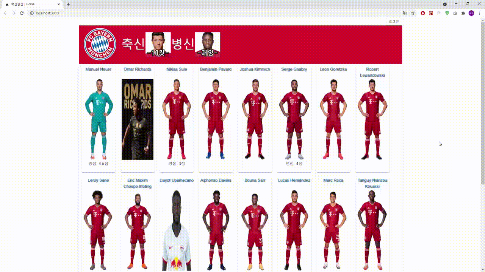
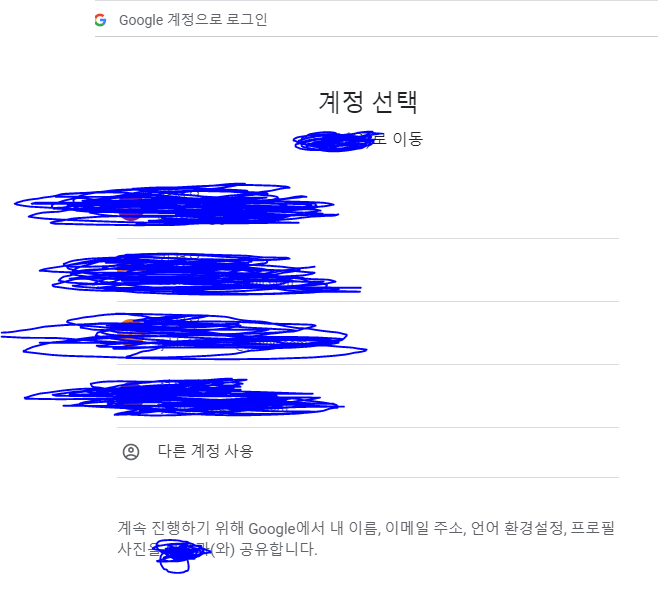
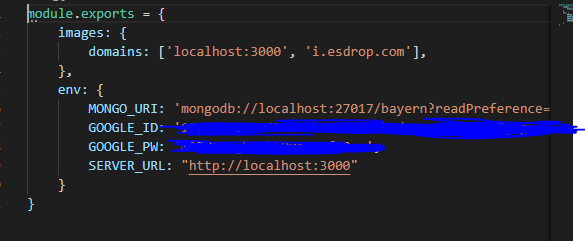

    Rate & Comment the Bayern Players Project!

    Next.js + MongoDB + Typescript + Google OAuth2.0

#

[1] create next.config.js in root folder.  
#

#
[2] setting Google OAuth2.0
#
I used Google OAuth2.0 for login&logout system.
The gif above did not show the contents about Google OAuth.
If success, you can see it when click the login button

#
[3] setting config.js.
#
if you run this project locally, Setting 

SERVER_URL: "http://localhost:3000"

images: {

domains: ['localhost:3000'],

}

and put your mongodb_url, google oauth2.0's id and password.
like below

Else run this project heroku or aws or vercel... and so on... 

change SERVER_URL, images domains, mongodb_uri 

#
[4] make players collections and input no, name, img url.
#

sorry. I can't share image url with you.

I think just modify and transform this project, you can use it as a review system such as watchapedia or imdb, 요기요, and so on...